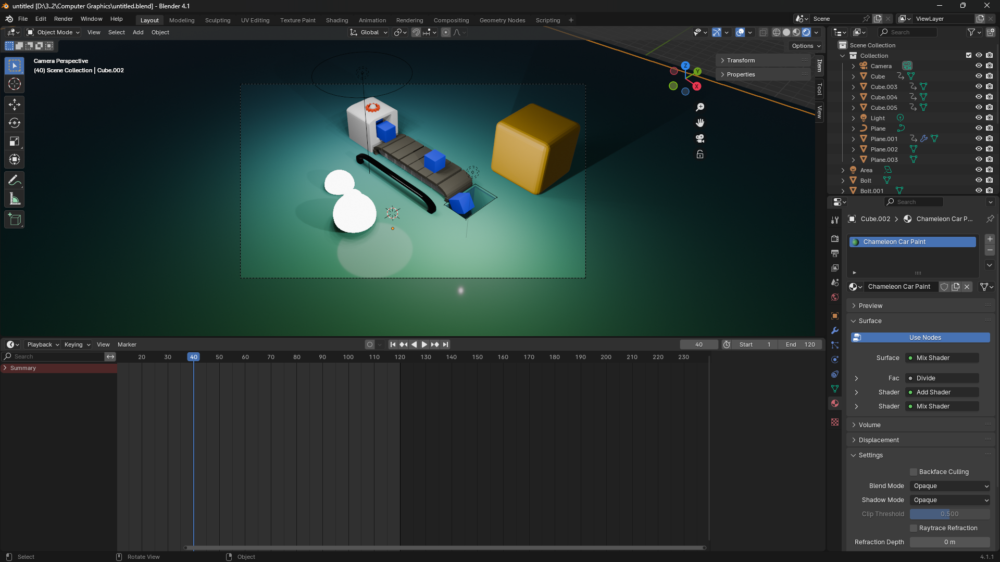

# 🏭 Factory Belt Animation — Blender Project

A stylized **factory conveyor belt animation** built in **Blender 4.1**, featuring animated objects, custom shaders, and a playful low-poly art style.

---

## 📸 Preview

<!-- Replace with your actual render or animation export -->


---

## 🛠️ Project Details

| Property | Details |
|----------|---------|
| **Software** | Blender 4.1 |
| **File** | `untitled.blend` |
| **Type** | 3D Animation |
| **Frame Range** | 1 – 120 |
| **Render Engine** | Cycles / EEVEE |

---

## 🎬 Scene Overview

A stylized factory scene where objects travel along a conveyor belt. The scene includes:

- 🔩 **Conveyor Belt** — Dark segmented belt moving objects through the scene
- 📦 **Cubes** — Multiple colored cubes (blue & gold) being processed on the belt
- ⚪ **Character** — A white blob/snowman figure watching the factory
- 💡 **Lighting** — Area light setup with a warm green studio floor
- 🔧 **Props** — Bolts and structural plane elements framing the scene

---

## 🎨 Materials

| Material | Description |
|----------|-------------|
| **Chameleon Car Paint** | Metallic iridescent shader using Mix + Add Shader nodes |
| **Belt material** | Dark segmented conveyor surface |
| **Cube colors** | Solid blue and golden/orange cube materials |

### Shader Highlight — Chameleon Car Paint
Built using a node setup of:
- **Mix Shader** → **Divide** factor
- **Add Shader** for layered reflections
- **Mix Shader** for final surface blend

---

## 📁 File Structure

```
📦 blender-factory-animation/
 ┣ 📄 untitled.blend      # Main Blender project file
 ┣ 📄 README.md           # This file
 ┗ 📄 .gitignore          # Excludes temp Blender files
```

---

## 🚀 Getting Started

1. **Clone the repository:**
   ```bash
   git clone https://github.com/YOUR_USERNAME/YOUR_REPO_NAME.git
   ```

2. **Open in Blender:**
   - Launch Blender 4.1 or later
   - Go to `File → Open` and select `untitled.blend`

3. **Play the animation:**
   - Press `Space` to play, or `F12` to render a single frame
   - Go to `Render → Render Animation` to export the full sequence

---

## ⚙️ Requirements

- [Blender 4.1+](https://www.blender.org/download/) (free & open source)

---

## 🙏 Credits

This project was made following this amazing tutorial:

> 📺 **[Blender Factory Animation Tutorial](https://youtu.be/OhzcCsR_EO0?si=Dym--hPgCsR_EO0)** by **Polygon Runway**

Huge thanks for the clear and creative walkthrough — a fantastic resource for learning animation and stylized 3D in Blender!

---

## 📄 License

This project is for personal/educational use. Feel free to use it as a learning reference.
